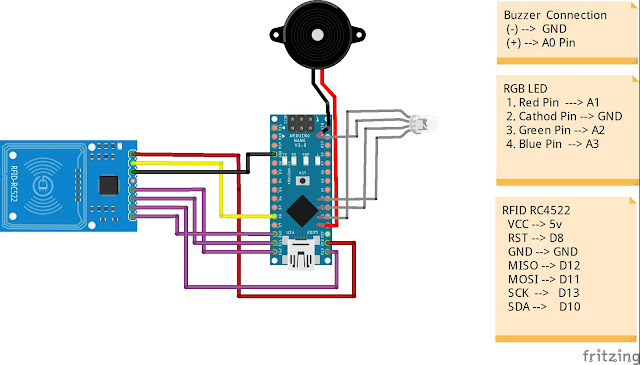

# RFEX Door Lock Device

This repository contains the code for an RFID based door lock device named RFEX

## RFID Access Algorithm
The access algorithm is used to grant access to the user with a valid RFID key. When a user presents their key to the device, the device reads the key and compares it to the list of authorized keys. If the key is found to be authorized, the device unlocks the door. If the key is not authorized, the device denies access.

## DumpInfo Algorithm
The dump algorithm is used to extract the information stored on an RFID key. When an authorized user presents their key to the device, the device reads and displays the information on the key.

## CloneKey Algorithm
The clone algorithm is used to create a copy of an RFID key. When an authorized user presents their key to the device, the device reads the information on the key and writes it to a blank key. The cloned key can then be used to access the device as if it were the original key.

## Usage
The RFEX door lock device is built using an Arduino board and an RFID reader. The code is written in Arduino C++ and can be uploaded to the board using the Arduino IDE.

To use the device, connect the Arduino board to the RFID reader and upload the code to the board. Add the authorized RFID keys to the code and upload the modified code to the board.

Once the device is set up, use the access algorithm to grant access to authorized users, use the dump algorithm to view the information stored on an RFID key, and use the clone algorithm to create a copy of an authorized RFID key.

## License
This project is licensed under the MIT License

